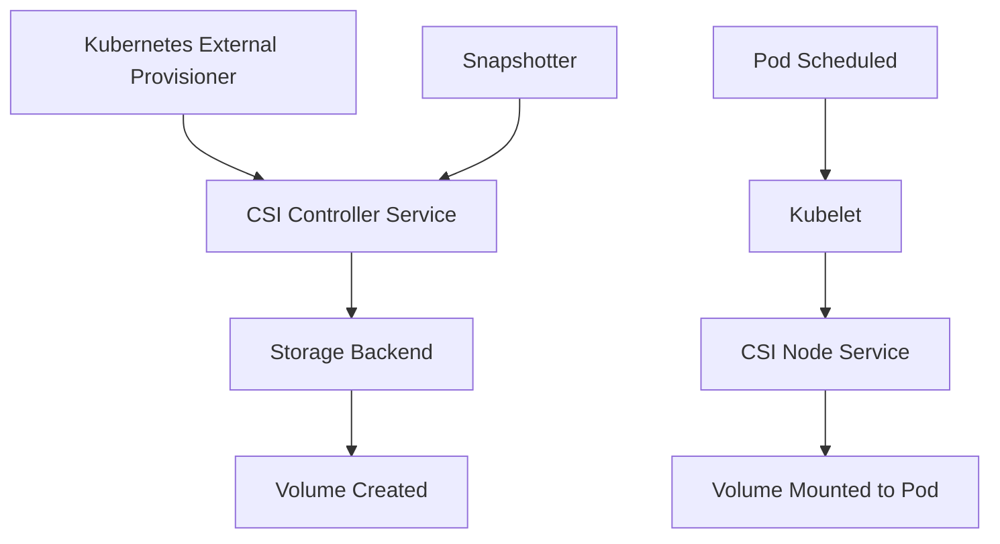

# CSI Storage Plugins

Container Storage Interface (CSI) is a standard for exposing arbitrary block and file storage systems to containerized workloads. CSI drivers run as external provisioners that interact with Kubernetes via the CSI specification. They handle dynamic provisioning, volume attachment/detachment, snapshotting, cloning, and resizing.

## CSI Architecture

A CSI driver consists of three gRPC services:

1. **Identity**: Reports driver capabilities and health.
2. **Controller**: Provisions volumes, snapshots, clones, and manages volume lifecycles (runs on the controller plane or a separate pod).
3. **Node**: Mounts volumes to pods and manages filesystem formatting (runs as a DaemonSet on every node).



## Common CSI Drivers

### aws-ebs (AWS Elastic Block Store)

The AWS EBS CSI driver provisions EBS volumes on AWS EC2 instances. It supports gp2, gp3, io1, io2, and st1/sc1 volume types.

**Key characteristics:**
- Supports multiple EBS volume types: gp2 (default), gp3 (recommended), io1/io2 (provisioned IOPS), st1 (throughput optimized), sc1 (cold HDD)
- Supports EBS multi-attach for io1/io2 volumes (ReadWriteMany)
- Supports volume resizing without pod restart (in-place expansion)
- Supports snapshots and cloning
- Requires IAM permissions for the controller and node

**Installation:**

```bash
# Install the AWS EBS CSI driver using helm
helm repo add aws-ebs-csi-driver https://kubernetes-sigs.github.io/aws-ebs-csi-driver
helm install aws-ebs-csi-driver aws-ebs-csi-driver/aws-ebs-csi-driver \
  --namespace kube-system

# Or using manifests
kubectl apply -k "github.com/kubernetes-sigs/aws-ebs-csi-driver/deploy/kubernetes/overlays/stable/?ref=master"
```

**Example StorageClass:**

```yaml
apiVersion: storage.k8s.io/v1
kind: StorageClass
metadata:
  name: ebs-sc
provisioner: ebs.csi.aws.com
parameters:
  type: gp3
  iops: "3000"
  throughput: "125"
  encrypted: "true"
  kmsKeyId: "arn:aws:kms:..."
reclaimPolicy: Delete
volumeBindingMode: WaitForFirstConsumer
```

**When to use:**
- AWS-based clusters (EKS or self-managed)
- Need for high-performance SSD storage (gp3)
- Provisioned IOPS workloads (io1/io2)

### azure-disk (Azure Managed Disks)

The Azure Disk CSI driver provisions managed disks on Azure VMs. It supports standard SSD, premium SSD, ultra disks, and standard HDD.

**Key characteristics:**
- Supports Standard SSD, Premium SSD, Ultra Disk, and Standard HDD
- Supports disk caching modes (None, ReadOnly, ReadWrite)
- Supports volume resizing
- Supports snapshots and cloning
- Uses `disk.csi.azure.com` as the provisioner name
- Requires Azure identity (managed identity or service principal)

**Installation:**

```bash
# Using helm
helm repo add azuredisk-csi-driver https://raw.githubusercontent.com/kubernetes-sigs/azuredisk-csi-driver/master/charts
helm install azuredisk-csi-driver azuredisk-csi-driver/azuredisk-csi-driver \
  --namespace kube-system

# Or using manifests
kubectl apply -f https://raw.githubusercontent.com/kubernetes-sigs/azuredisk-csi-driver/master/deploy/install-driver.yaml
```

**Example StorageClass:**

```yaml
apiVersion: storage.k8s.io/v1
kind: StorageClass
metadata:
  name: azure-disk-sc
provisioner: disk.csi.azure.com
parameters:
  skuname: Premium_LRS
  cachingMode: ReadWrite
  kind: Managed
reclaimPolicy: Delete
volumeBindingMode: WaitForFirstConsumer
```

**When to use:**
- Azure-based clusters (AKS or self-managed)
- Need for ultra disk performance (high IOPS, low latency)
- When using Azure availability zones for disk resiliency

### gce-pd (Google Compute Engine Persistent Disk)

The GCE PD CSI driver provisions persistent disks on GCP GKE clusters or self-managed GCE instances.

**Key characteristics:**
- Supports pd-standard (HDD), pd-balanced, pd-ssd, and pd-extreme
- Supports multi-writer for GKE Filestore (CIFS/NFS)
- Supports volume resizing (pd-ssd and pd-extreme)
- Supports snapshots and cloning
- Uses `pd.csi.storage.gke.io` (GKE and self-managed GCE)

**Installation:**

```bash
# GKE clusters include the driver by default
gcloud container clusters create my-cluster \
  --release-channel regular \
  --scopes=storage-full

# Self-managed GCE clusters
kubectl apply -f https://raw.githubusercontent.com/kubernetes-sigs/gcp-compute-persistent-disk-csi-driver/master/deploy/install-driver.yaml
```

**Example StorageClass:**

```yaml
apiVersion: storage.k8s.io/v1
kind: StorageClass
metadata:
  name: gce-pd-sc
provisioner: pd.csi.storage.gke.io
parameters:
  type: pd-ssd
  replication-type: none
reclaimPolicy: Delete
volumeBindingMode: WaitForFirstConsumer
```

**When to use:**
- GCP-based clusters (GKE or self-managed)
- Need for high-throughput SSD storage
- When using regional persistent disks for zone failure resilience

### vSphere (vSphere CSI Driver)

The vSphere CSI driver provisions persistent volumes using vSphere storage (VMFS or vSAN). It supports Kubernetes running on vSphere VMs.

**Key characteristics:**
- Supports VMFS and vSAN datastores
- Supports vSAN file services for ReadWriteMany volumes
- Supports volume resizing
- Supports snapshots and cloning
- Uses `csi.vsphere.vmware.com` as the provisioner name
- Integrates with vSphere CNS (Cloud Native Storage) for advanced features

**Installation:**

```bash
# Using kubectl
kubectl apply -f https://raw.githubusercontent.com/kubernetes-sigs/vsphere-csi-driver/master/manifests/vanilla/install-driver.yaml

# Using helm
helm repo add vsphere-csi-driver https://kubernetes-sigs.github.io/vsphere-csi-driver/
helm install vsphere-csi-driver vsphere-csi-driver/vsphere-csi-driver \
  --namespace kube-system
```

**Example StorageClass:**

```yaml
apiVersion: storage.k8s.io/v1
kind: StorageClass
metadata:
  name: vsphere-sc
provisioner: csi.vsphere.vmware.com
parameters:
  storagepolicyname: "vSAN Default Storage Policy"
  csi.storage.k8s.io/fstype: "ext4"
reclaimPolicy: Delete
volumeBindingMode: WaitForFirstConsumer
```

**When to use:**
- Kubernetes clusters running on vSphere
- Need for vSAN storage policies
- When leveraging existing vSphere storage infrastructure

### Longhorn

Longhorn is a distributed block storage system for Kubernetes. It replicates volumes across nodes and provides a web UI for management.

**Key characteristics:**
- Distributed block storage with node-level replication (default 3 replicas)
- Self-hosted: Longhorn components run as workloads in the cluster
- Supports ReadWriteOnce (default) and ReadWriteMany via Longhorn NFS
- Supports incremental snapshots and backups to NFS/S3/CEPH/SMB
- Supports volume encryption and data locality
- Built-in web UI for management
- Supports in-place expansion without pod restart

**Installation:**

```bash
# Using helm
helm repo add longhorn https://charts.longhorn.io
helm install longhorn longhorn/longhorn \
  --namespace longhorn-system \
  --create-namespace

# Or using kubectl
kubectl apply -f https://raw.githubusercontent.com/longhorn/longhorn/master/deploy/longhorn.yaml
```

**Example StorageClass:**

```yaml
apiVersion: storage.k8s.io/v1
kind: StorageClass
metadata:
  name: longhorn-sc
provisioner: driver.longhorn.io
parameters:
  numberOfReplicas: "3"
  staleReplicaTimeout: "30"
  fromBackup: ""
  fsType: "ext4"
reclaimPolicy: Delete
volumeBindingMode: Immediate
```

**When to use:**
- Bare-metal or on-premises clusters without cloud storage
- Need for distributed storage with self-healing
- Development and test environments
- Edge computing where local storage must be resilient

### TopoLVM

TopoLVM is a CSI driver that manages LVM volumes on Kubernetes nodes. It is topology-aware and can schedule pods on nodes with sufficient LVM space.

**Key characteristics:**
- Uses LVM (Logical Volume Manager) on Linux nodes
- Topology-aware: can schedule pods on nodes with sufficient available capacity
- Supports volume resizing
- Supports snapshots (using LVM thin snapshots)
- Uses `topolvm.cybozu.com` as the provisioner name
- Integrates with the Kubernetes scheduler via a scheduler extender

**Installation:**

```bash
# Using helm
helm repo add topolvm https://topolvm.github.io/topolvm
helm install topolvm topolvm/topolvm \
  --namespace topolvm-system \
  --create-namespace

# Or using kubectl
kubectl apply -f https://raw.githubusercontent.com/topolvm/topolvm/main/deploy/topolvm.yaml
```

**Example StorageClass:**

```yaml
apiVersion: storage.k8s.io/v1
kind: StorageClass
metadata:
  name: topolvm-sc
provisioner: topolvm.cybozu.com
parameters:
  "topolvm.cybozu.com/device-class": "ssd"
reclaimPolicy: Delete
volumeBindingMode: WaitForFirstConsumer
allowVolumeExpansion: true
```

**Example DeviceClass:**

```yaml
apiVersion: topolvm.cybozu.com/v1
kind: DeviceClass
metadata:
  name: ssd
spec:
  volumeGroup: "vg_ssd"
  reclaimPolicy: Delete
  thin: false
```

**When to use:**
- On-premises clusters with existing LVM storage
- Need for topology-aware local storage
- High-performance local SSD workloads

## CSI Driver Comparison

| Driver | Provisioner | Platform | Multi-Attach | Resizing | Snapshots | Encryption | Best For |
|--------|-------------|----------|--------------|----------|-----------|------------|----------|
| aws-ebs | `ebs.csi.aws.com` | AWS | No (io1/io2 only) | Yes | Yes | Yes | AWS EKS / EC2 |
| azure-disk | `disk.csi.azure.com` | Azure | No | Yes | Yes | Yes | Azure AKS |
| gce-pd | `pd.csi.storage.gke.io` | GCP | No | Yes | Yes | Yes | GCP GKE |
| vSphere | `csi.vsphere.vmware.com` | vSphere | vSAN only | Yes | Yes | vSAN only | vSphere workloads |
| Longhorn | `driver.longhorn.io` | Any | Yes (via NFS) | Yes | Yes | Yes | Bare-metal / on-prem |
| TopoLVM | `topolvm.cybozu.com` | Any (LVM) | No | Yes | Yes | LUKS | LVM on bare-metal |

## Best Practices

1. **Use `WaitForFirstConsumer` binding mode**: Delays volume provisioning until a pod is scheduled, ensuring the volume is created in the correct availability zone.
2. **Enable `allowVolumeExpansion`**: Allows volumes to be resized without deleting and recreating the PVC.
3. **Use storage class annotations**: Annotate StorageClasses with reclaim policies, mount options, and encryption settings.
4. **Monitor CSI driver health**: Use `csi-resizer` and `csi-snapshotter` sidecar metrics for visibility.
5. **Prefer regional disks**: Use regional persistent disks (AWS, GCP) or vSAN for higher availability across zones.

## Troubleshooting

| Symptom | Likely Cause | Fix |
|---------|-------------|-----|
| PVC stuck in `Pending` | StorageClass not found or provisioner not running | Check `kubectl get storageclass`, verify CSI controller pods are running |
| Volume attachment fails | Node does not have required permissions or storage not available | Check node identity/permissions, verify storage capacity in cloud console |
| `Volume is attached but not mounted` | Kubelet CSI node plugin not running or misconfigured | Check node CSI pod logs, verify mount point exists on node |
| Snapshot fails | CSI snapshotter sidecar not deployed or snapshot class missing | Deploy snapshot sidecar, create VolumeSnapshotClass |
| Resize not working | `allowVolumeExpansion` not enabled or filesystem not resized | Enable expansion on StorageClass, run `resize2fs` or `xfs_growfs` in pod |
| Slow I/O | Wrong volume type or throttled IOPS | Check volume type (gp3 vs gp2), verify IOPS/throughput limits |

## Commands

```bash
# List installed CSI drivers
kubectl get csidrivers
kubectl get csistoragecapacities

# Check StorageClasses
kubectl get storageclass
kubectl describe storageclass gp2

# Check PVC status
kubectl get pvc
kubectl describe pvc <pvc-name>

# Verify CSI controller and node pods
kubectl get pods -n kube-system -l app=ebs-csi-controller
kubectl get pods -n kube-system -l app=ebs-csi-node
kubectl get pods -n kube-system -l app=csi-hostpath-controller
kubectl get pods -n kube-system -l app=csi-hostpath-node

# Check CSI capabilities
kubectl get csidrivers ebs.csi.aws.com -o yaml

# Volume attachment status
kubectl get volumeattachments
kubectl describe volumeattachment <attachment-name>

# Create snapshot
kubectl apply -f - <<EOF
apiVersion: snapshot.storage.k8s.io/v1
kind: VolumeSnapshot
metadata:
  name: my-snapshot
spec:
  volumeSnapshotClassName: ebs-snapshot-sc
  source:
    persistentVolumeClaimName: my-pvc
EOF

# Verify CSI driver deployment
kubectl get deployment -n kube-system ebs-csi-controller
kubectl get daemonset -n kube-system ebs-csi-node

# Check CSI logs
kubectl logs -n kube-system deployment/ebs-csi-controller -c csi-provisioner
kubectl logs -n kube-system daemonset/ebs-csi-node -c csi-node-driver-registrar
```
