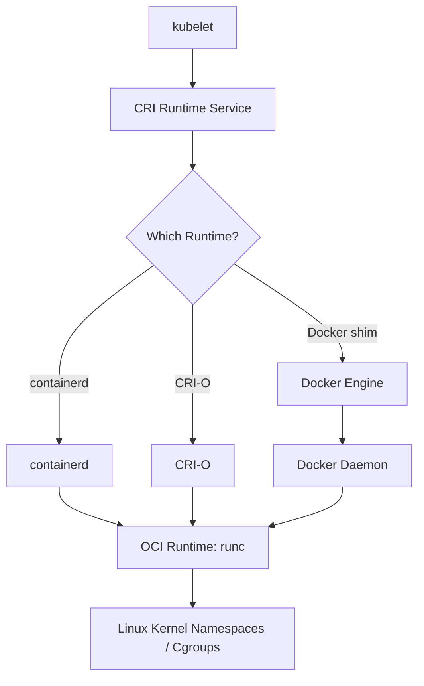
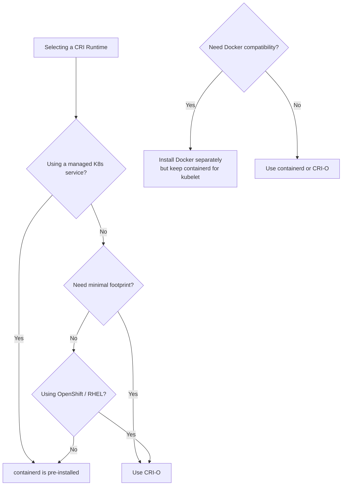

# CRI Container Shims

The Container Runtime Interface (CRI) is a plugin interface that enables kubelet to use different container runtimes. CRI defines two gRPC services: `RuntimeService` (manages pods and containers) and `ImageService` (manages container images). Container runtimes implement these services so that kubelet can manage containers without knowing the runtime details.

## How CRI Works

When kubelet needs to run a pod, it communicates with the CRI runtime via a Unix socket (typically `/var/run/dockershim.sock` for Docker, `/run/containerd/containerd.sock` for containerd, or `/var/run/crio/crio.sock` for CRI-O).



## Runtime Comparison

### containerd

containerd is a high-performance container runtime that implements the CRI interface. It is the default runtime for most Kubernetes distributions today, including EKS, AKS, GKE, and kubeadm.

**Key characteristics:**
- Implements CRI natively (no shim required)
- Manages the full container lifecycle: image transfer, storage, container execution, supervision
- Uses `runC` as the low-level OCI runtime
- Supports snapshotters for efficient image extraction
- Runs as a systemd service (`containerd`)
- Exposes a Unix socket at `/run/containerd/containerd.sock`
- Supports sandboxed containers (Kata, gVisor) via the `io.containerd.kind` annotation

**Architecture:**

```
kubelet
  └── CRI --> containerd
                ├── Image Manager (pulling, unpacking)
                ├── Container Manager (creating, starting, stopping)
                └── runC (OCI runtime executing in namespaces)
```

**Configuration:**

```yaml
# /etc/containerd/config.toml
version = 2

[plugins."io.containerd.grpc.v1.cri".cni]
  bin_path = "/opt/cni/bin"
  conf_dir = "/etc/cni/net.d"

[plugins."io.containerd.grpc.v1.cri".containerd]
  default_runtime_name = "runc"
  snapshotter = "overlayfs"

[plugins."io.containerd.grpc.v1.cri".containerd.runtimes.runc]
  runtime_type = "io.containerd.runc.v2"
```

**When to use:**
- Default choice for new clusters
- Production environments requiring stability and performance
- When using managed Kubernetes services (EKS, AKS, GKE)

### CRI-O

CRI-O is a lightweight, OCI-native container runtime specifically designed for Kubernetes. It is a CNCF project that implements only the CRI interface, with no extra features.

**Key characteristics:**
- Purpose-built for Kubernetes (implements only CRI)
- Supports OCI-compliant container images and runtimes
- Uses `conmon` (container monitor) for container lifecycle supervision
- Supports multiple OCI runtimes: runc, crun, Kata
- Smaller attack surface than containerd or Docker
- Uses `/var/run/crio/crio.sock` by default
- Integrates with systemd for cgroup management

**Architecture:**

```
kubelet
  └── CRI --> CRI-O
                ├── Image Management (skopeo for pulling)
                ├── Container Management (conmon + runc)
                └── Network Setup (CNI plugins)
```

**Configuration:**

```yaml
# /etc/crio/crio.conf
[crio]
  storage_driver = "overlay"
  storage_option = []

[crio.cni]
  plugin_dirs = ["/opt/cni/bin", "/etc/cni/net.d"]

[crio.runtime]
  default_runtime = "runc"
  runtimes = {
    runc = {
      runtime_path = "/usr/bin/runc"
    },
    crun = {
      runtime_path = "/usr/bin/crun"
    }
  }
```

**When to use:**
- Minimalist Kubernetes deployments
- Environments where you want only CRI functionality (no Docker/containerd extras)
- Edge or embedded Kubernetes where resource footprint matters
- Fedora, RHEL, and OpenShift (OpenShift uses CRI-O)

### Docker Shim (Deprecated)

The Docker shim was a translation layer that converted CRI calls into Docker Engine API calls. It was used when Docker Engine was the default runtime in older Kubernetes versions.

**Key characteristics:**
- Translates CRI to Docker Engine API
- Requires Docker Engine daemon running alongside kubelet
- Deprecated in Kubernetes 1.20, removed in 1.24
- Replaced by direct containerd integration

**Removal timeline:**
- Kubernetes 1.20: Docker Engine support deprecated
- Kubernetes 1.24: Dockershim removed from kubelet
- Kubernetes 1.24+: Must use containerd or CRI-O

**If you see this error:**

```bash
# Error: failed to run Kubelet: misconfiguration: kubelet cgroup driver: 'cgroupfs' is different from docker cgroup driver: 'systemd'
```

This occurs when migrating from Docker to containerd. Fix by aligning cgroup drivers:

```bash
# On containerd nodes
containerd config default | sed 's/SystemdCgroup = false/SystemdCgroup = true/' > /etc/containerd/config.toml
systemctl restart containerd
```

**When to use:**
- **Do not use**. Docker shim was removed in Kubernetes 1.24. If you need Docker CLI tools, use Docker Engine independently (not as the kubelet CRI runtime).

## Runtime Feature Matrix

| Feature | containerd | CRI-O | Docker Shim |
|---------|-----------|-------|-------------|
| CRI Native | Yes | Yes | No (translated) |
| Status | Stable | Stable | Removed in 1.24 |
| Default in EKS/AKS/GKE | Yes | No | No |
| Default in OpenShift | No | Yes | No |
| OCI Runtime | runC | runC/crun | runC (via Docker) |
| Image Management | Built-in | Built-in | Docker Engine |
| Snapshotter | overlay, nydus, stargz | overlay, fuse-overlayfs | overlay (via Docker) |
| Security | Medium | High (minimal) | N/A |

## Runtime Selection Flowchart



## Installation

### containerd

```bash
# Ubuntu/Debian
apt-get update && apt-get install -y containerd

# Configure containerd
mkdir -p /etc/containerd
containerd config default > /etc/containerd/config.toml
sed -i 's/SystemdCgroup = false/SystemdCgroup = true/' /etc/containerd/config.toml
systemctl restart containerd

# Verify
crictl info
```

### CRI-O

```bash
# Ubuntu/Debian
modprobe overlay
apt-get update && apt-get install -y cri-o

# Configure
cat <<EOF > /etc/crio/crio.conf
[crio]
  storage_driver = "overlay"
EOF

systemctl restart crio

# Verify
crictl info
```

### Verifying the Runtime

```bash
# Check kubelet configuration
ps aux | grep kubelet | grep container-runtime

# Check running runtime
crictl info | grep -i runtimeName
crictl ps
crictl images

# Check node runtime class
kubectl get node <node-name> -o jsonpath='{.status.images[*].names[*]}'

# Test with a pod
kubectl run test-pod --image=alpine --restart=Never -- sleep 3600
kubectl exec -it test-pod -- cat /proc/1/cgroup
```

## Best Practices

1. **Use containerd for most deployments**: It is the most widely supported and tested runtime.
2. **Align cgroup drivers**: Ensure kubelet, containerd/CRI-O, and Docker all use the same cgroup driver (systemd recommended).
3. **Pin container runtime versions**: Avoid automatic upgrades in production; test new versions before rolling out.
4. **Use `crictl` for debugging**: `crictl` is the standard CLI for CRI-compatible runtimes, replacing `docker` commands.
5. **Enable systemd cgroups**: Set `SystemdCgroup = true` in containerd to match kubelet's cgroup configuration.

## Troubleshooting

| Symptom | Likely Cause | Fix |
|---------|-------------|-----|
| `failed to create containerd task` | containerd not running or misconfigured | Check `systemctl status containerd`, verify config.toml |
| `cgroup driver mismatch` | kubelet and runtime use different cgroup drivers | Align both to `systemd` |
| `image not found` | Image not pulled or CRI cannot access registry | Check image pull secrets, verify registry connectivity |
| `permission denied` on container exec | Seccomp or AppArmor profile blocking exec | Relax seccomp profile or use privileged mode for debugging |
| `containerd: unknown service` | kubelet configured with wrong CRI socket | Verify kubelet `--container-runtime-endpoint` flag |
| Pod stuck in `CrashLoopBackOff` after runtime upgrade | Runtime version incompatible with kubelet | Pin compatible runtime versions |

## Commands

```bash
# Check runtime version
containerd --version
crio --version

# Check kubelet runtime endpoint
ps aux | grep kubelet | grep runtime-endpoint

# List containers with crictl
crictl ps -a
crictl images
crictl inspect <container-id>

# Pull an image
crictl pull alpine:latest

# Run a container with CRI
crictl run config.json sandbox-config.json

# Check containerd logs
journalctl -u containerd -f
journalctl -u crio -f

# Check kubelet logs for CRI errors
journalctl -u kubelet -f | grep -i 'cri\|containerd\|crio'

# Verify cgroup configuration
kubectl get node <node> -o jsonpath='{.status.images[*].names[*]}'
cat /proc/1/cgroup

# Check runtime classes
kubectl get runtimeclasses
kubectl describe runtimeclass nvidia

# Restart runtime
systemctl restart containerd
systemctl restart crio
```
