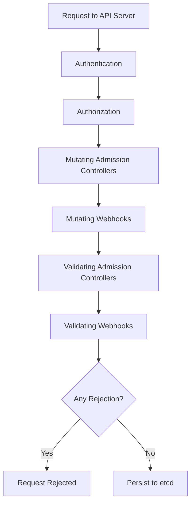

# Admission Plugins

Admission plugins intercept requests to the Kubernetes API server before they are persisted to `etcd`. They enforce policies, validate resources, and mutate objects. There are two categories: built-in admission controllers (compiled into `kube-apiserver`) and admission webhooks (external HTTP services).

## Admission Control Flow

Admission plugins run after authentication and authorization but before persistence. The API server invokes them in a defined order.



## Built-in Admission Controllers

Built-in admission controllers are enabled by passing flags to `kube-apiserver`. They handle standard Kubernetes policies without requiring external services.

### AlwaysAdmit

**Deprecated**: Accepts all requests. Was the default in early Kubernetes versions. No longer recommended or available in newer versions.

### AlwaysPullImages

Forces all containers to always pull images from the registry, even if the image is already present on the node. This ensures nodes do not use stale cached images.

**Configuration:**

```bash
# kube-apiserver flag
--enable-admission-plugins=AlwaysPullImages
```

### DefaultStorageClass

Sets the `storageClassName` for PersistentVolumeClaims that do not specify one. Uses the default StorageClass in the cluster.

### DefaultTolerationSeconds

Sets default tolerations for pods that have the `TolerationSeconds` field set. Automatically adds tolerations for `node.kubernetes.io/not-ready` and `node.kubernetes.io/unreachable`.

### DenyEscalatingExec

Prevents users from executing commands in pods that have `allowPrivilegeEscalation: true` or are privileged. Blocks `exec` and `attach` operations.

### EventRateLimit

Limits the rate at which events are created per object. Prevents event storms from overwhelming the API server.

**Configuration:**

```yaml
apiVersion: config.k8s.io/v1
kind: EventRateLimitConfiguration
limits:
  - type: Server
    qps: 5000
    burst: 10000
  - type: Namespace
    qps: 100
    burst: 200
  - type: User
    qps: 50
    burst: 100
```

### LimitRanger

Enforces `LimitRange` constraints. Injects default resource requests and limits into pods that do not specify them. Rejects pods that violate min/max constraints.

**Example LimitRange:**

```yaml
apiVersion: v1
kind: LimitRange
metadata:
  name: default-limits
  namespace: my-namespace
spec:
  limits:
    - type: Container
      default:
        cpu: "200m"
        memory: "256Mi"
      defaultRequest:
        cpu: "100m"
        memory: "128Mi"
      max:
        cpu: "2"
        memory: "4Gi"
      min:
        cpu: "50m"
        memory: "64Mi"
```

### MutatingAdmissionWebhook

Injects changes into objects before they are stored. Used for sidecar injection, label injection, and default resource limits.

### ValidatingAdmissionWebhook

Validates requests against external logic. Rejects requests that do not conform to organizational policies.

### NamespaceLifecycle

Enforces lifecycle rules for namespaces. Prevents the creation of new namespaces if the limit has been reached. Prevents the deletion of namespaces that have active resources. Terminates all objects when a namespace is deleted.

### NodeRestriction

Restricts kubelets to only modifying their own node resources. Prevents a compromised kubelet from modifying other nodes or the cluster control plane.

### PodSecurity

Enforces Pod Security Standards (PSS) at the pod level. Replaces the deprecated `PodSecurityPolicy` admission controller.

**Modes:**
- **`enforce`**: Rejects pods that violate the policy.
- **`audit`**: Logs violations but does not reject.
- **`warn`**: Warns the user but does not reject.

**Example:**

```yaml
apiVersion: v1
kind: Namespace
metadata:
  name: restricted-ns
  labels:
    pod-security.kubernetes.io/enforce: restricted
    pod-security.kubernetes.io/enforce-version: latest
    pod-security.kubernetes.io/audit: restricted
    pod-security.kubernetes.io/audit-version: latest
    pod-security.kubernetes.io/warn: restricted
    pod-security.kubernetes.io/warn-version: latest
```

### ResourceQuota

Enforces `ResourceQuota` constraints. Rejects pod creation if the namespace has exceeded its quota.

**Example ResourceQuota:**

```yaml
apiVersion: v1
kind: ResourceQuota
metadata:
  name: compute-quota
  namespace: my-namespace
spec:
  hard:
    requests.cpu: "10"
    requests.memory: "20Gi"
    limits.cpu: "20"
    limits.memory: "40Gi"
    pods: "50"
    services: "20"
```

### ServiceAccount

Automatically creates and attaches a `ServiceAccount` to pods that do not specify one. Populates `ServiceAccount` tokens and credentials.

## Mutating Admission Webhooks

Mutating webhooks modify the object before it is persisted. They can inject sidecars, modify labels, add default configurations, or enforce organizational standards.

### How Mutating Webhooks Work

1. The API server receives a request to create/modify a resource.
2. The request is sent to the mutating webhook service.
3. The webhook receives the object in its current state.
4. The webhook modifies the object (or leaves it unchanged).
5. The modified object is returned to the API server.
6. The API server continues processing the request with the modified object.

```yaml
apiVersion: admissionregistration.k8s.io/v1
kind: MutatingWebhookConfiguration
metadata:
  name: sidecar-injector
webhooks:
  - name: sidecar-injector.example.com
    rules:
      - operations: ["CREATE"]
        apiGroups: [""]
        apiVersions: ["v1"]
        resources: ["pods"]
    clientConfig:
      service:
        name: sidecar-injector
        namespace: injection-system
        path: "/inject"
      caBundle: LS0t...
    admissionReviewVersions: ["v1"]
    sideEffects: None
    timeoutSeconds: 5
```

### Common Mutating Webhook Use Cases

- **Sidecar injection**: Automatically inject a logging or monitoring sidecar into pods.
- **Label injection**: Add standard labels to resources.
- **Default resource limits**: Inject resource requests and limits for pods that do not specify them.
- **Image policy enforcement**: Reject or rewrite images that do not match organizational policies.

## Validating Admission Webhooks

Validating webhooks reject requests that do not conform to organizational policies. They do not modify the object.

### How Validating Webhooks Work

1. The API server receives a request to create/modify a resource.
2. The request is sent to the validating webhook service.
3. The webhook receives the object in its current state.
4. The webhook validates the object.
5. If validation fails, the webhook returns an error and the request is rejected.
6. If validation passes, the webhook returns success and the request proceeds.

```yaml
apiVersion: admissionregistration.k8s.io/v1
kind: ValidatingWebhookConfiguration
metadata:
  name: policy-enforcer
webhooks:
  - name: policy.enforcer.example.com
    rules:
      - operations: ["CREATE", "UPDATE"]
        apiGroups: [""]
        apiVersions: ["v1"]
        resources: ["pods"]
    clientConfig:
      service:
        name: policy-enforcer
        namespace: policy-system
        path: "/validate"
      caBundle: LS0t...
    admissionReviewVersions: ["v1"]
    sideEffects: None
    timeoutSeconds: 5
    failurePolicy: Fail
```

### Failure Policy

- **`Fail`**: If the webhook is unreachable or returns an error, the request is rejected. This is the recommended policy for production.
- **`Ignore`**: If the webhook is unreachable or returns an error, the request is allowed. This can lead to policy violations if the webhook is down.

> **Best practice**: Use `failurePolicy: Fail` for validating webhooks to ensure policies are always enforced.

## Webhook Configuration Options

| Option | Description |
|--------|-------------|
| `rules` | Which resources and operations the webhook applies to |
| `clientConfig` | The webhook service URL or CA bundle |
| `admissionReviewVersions` | Supported AdmissionReview versions |
| `sideEffects` | Whether the webhook has side effects (`None`, `NoneOnDryRun`, `Some`, `Unknown`) |
| `timeoutSeconds` | Webhook timeout (1-30 seconds) |
| `failurePolicy` | `Fail` or `Ignore` |
| `matchPolicy` | `Exact` or `Equivalent` |
| `namespaceSelector` | Selects which namespaces the webhook applies to |
| `objectSelector` | Selects which objects the webhook applies to |

## Best Practices

1. **Use webhooks for organizational policies**: Built-in controllers handle basic constraints; webhooks handle custom policies.
2. **Set `failurePolicy: Fail`**: Prevents policy bypass when webhooks are unavailable.
3. **Use `namespaceSelector` and `objectSelector`**: Limit webhooks to only the resources they need to process.
4. **Keep webhooks fast**: Webhooks add latency to every API request. Optimize webhook response times.
5. **Use `sideEffects: None`**: Indicates the webhook has no side effects, allowing the API server to retry safely.
6. **Monitor webhook availability**: Webhook outages can block all API requests if `failurePolicy: Fail`.
7. **Use OPA/Gatekeeper or Kyverno**: These tools provide policy-as-code capabilities for admission control.

## Troubleshooting

| Symptom | Likely Cause | Fix |
|---------|-------------|-----|
| `webhook timeout` | The webhook service is not responding within the timeout | Check the webhook pod status and logs |
| `webhook not found` | The webhook service or CA bundle is misconfigured | Verify the `clientConfig` in the webhook configuration |
| `request rejected by admission controller` | A webhook or built-in controller rejected the request | Check the API server logs for the specific rejection reason |
| `webhook has side effects` | The webhook is configured with `sideEffects: Unknown` or `Some` | Set `sideEffects: None` or `NoneOnDryRun` if possible |
| `failurePolicy: Ignore` allowing bad requests | When the webhook is down, requests bypass the policy | Consider switching to `failurePolicy: Fail` |
| Webhook causing high API server latency | The webhook is too slow | Optimize the webhook service or increase `timeoutSeconds` |

## Commands

```bash
# List all admission controllers
kubectl get pods -n kube-system -l component=kube-apiserver

# Check API server flags for admission controllers
ps aux | grep kube-apiserver | grep admission-control

# Get webhook configurations
kubectl get mutatingwebhookconfigurations
kubectl get validatingwebhookconfigurations

# Describe a webhook configuration
kubectl describe mutatingwebhookconfiguration sidecar-injector

# Test a webhook by creating a resource
kubectl apply -f test-pod.yaml -v 6

# Check API server audit logs for admission decisions
kubectl logs -n kube-system kube-apiserver-<node> | grep -i 'admission\|webhook'
```
