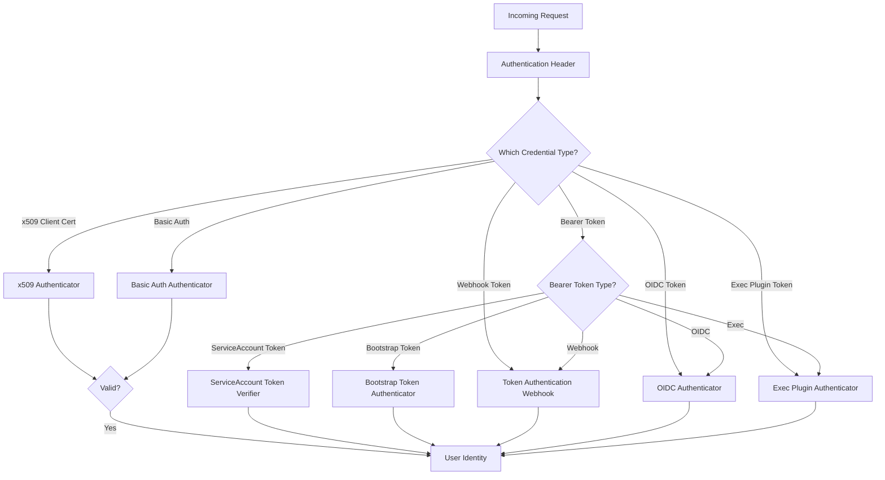
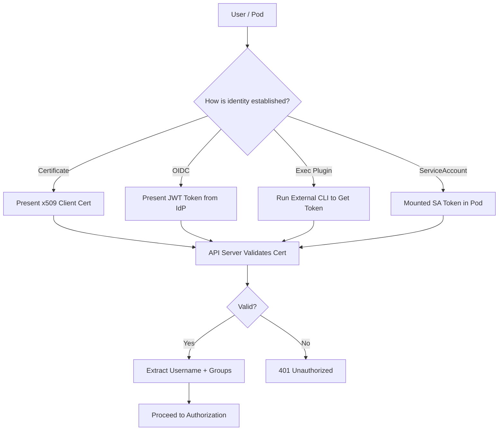

# Auth Plugins

Kubernetes uses several authentication mechanisms to verify the identity of users and services. The authentication plugins are configured in the API server and determine how credentials are validated.

## Authentication Architecture

Kubernetes does not manage users natively. Instead, it authenticates requests using external identity providers or built-in service account mechanisms. Multiple authenticators can be configured simultaneously; the API server tries each in sequence until one succeeds.



## Common Authentication Methods

### x509 Client Certificates

x509 certificates authenticate users by verifying a client certificate signed by a trusted CA. The certificate's Subject field maps to a username, and optional Organization fields map to groups.

**Configuration:**

```bash
# Generate a CA key and certificate
openssl genrsa -out ca.key 2048
openssl req -x509 -new -nodes -key ca.key -subj "/CN=my-ca" -days 10000 -out ca.crt

# Generate a client certificate
openssl genrsa -out user.key 2048
openssl req -new -key user.key -out user.csr -subj "/CN=alice/O=developers"
openssl x509 -req -in user.csr -CA ca.crt -CAkey ca.key -CAcreateserial -out user.crt -days 365

# Configure API server
kube-apiserver \
  --client-ca-file=/etc/kubernetes/pki/ca.crt \
  ...
```

**Usage:**

```bash
# Authenticate using the certificate
kubectl --client-certificate=user.crt --client-key=user.key --certificate-authority=ca.crt get pods

# Or using kubeconfig
kubectl config set-credentials alice \
  --client-certificate=user.crt \
  --client-key=user.key \
  --embed-certs=true
kubectl config set-context alice-context \
  --cluster=my-cluster \
  --user=alice
```

**Pros:**
- Strong cryptographic authentication
- No external identity provider required
- Works in air-gapped environments

**Cons:**
- Certificate rotation and revocation is complex
- No built-in user management (requires custom tooling)

### ServiceAccount Tokens

ServiceAccount tokens authenticate pods and services within the cluster. Each namespace has a default ServiceAccount, and additional ServiceAccounts can be created.

**Types of ServiceAccount tokens:**

1. **Legacy ServiceAccount tokens**: Projected as a volume using `ServiceAccount` volume source.
2. **Bound ServiceAccount tokens**: Time-bound, audience-restricted tokens projected via `Projected` volume source. The default in Kubernetes 1.24+.

**Example: Bound ServiceAccount token projection:**

```yaml
apiVersion: v1
kind: Pod
metadata:
  name: my-pod
spec:
  serviceAccountName: my-sa
  containers:
    - name: app
      image: alpine
      command: ['sh', '-c', 'sleep 3600']
      volumeMounts:
        - name: sa-token
          mountPath: /var/run/secrets/kubernetes.io/serviceaccount
          readOnly: true
  volumes:
    - name: sa-token
      projected:
        sources:
          - serviceAccountToken:
              path: token
              expirationSeconds: 3600
              audience: api
```

**Verification:**

```yaml
apiVersion: v1
kind: ServiceAccount
metadata:
  name: my-sa
automountServiceAccountToken: true
imagePullSecrets:
  - name: regcred
```

**Pros:**
- Managed automatically by Kubernetes
- No external provider needed
- Integrated with RBAC for authorization

**Cons:**
- Only for in-cluster workloads
- Bound tokens expire and must be refreshed

### OIDC Tokens

OpenID Connect (OIDC) tokens authenticate users via an external identity provider (e.g., Dex, Google, Azure AD, Okta). The API server validates the JWT token signature against the OIDC provider's public keys.

**Configuration:**

```bash
# API server flags
kube-apiserver \
  --oidc-issuer-url=https://dex.example.com/dex \
  --oidc-client-id=kubernetes \
  --oidc-username-claim=email \
  --oidc-groups-claim=groups \
  --oidc-ca-file=/etc/kubernetes/oidc/ca.crt
```

**Example kubeconfig using OIDC:**

```yaml
apiVersion: v1
kind: Config
users:
  - name: alice
    user:
      auth-provider:
        name: oidc
        config:
          client-id: kubernetes
          idp-issuer-url: https://dex.example.com/dex
          refresh-token: <refresh-token>
          id-token: <id-token>
```

**Pros:**
- Centralized identity management
- Supports MFA, SSO, and group synchronization
- Works with existing corporate IdPs

**Cons:**
- Requires external identity provider
- Network dependency for token validation

### Exec Plugins

Exec plugins authenticate by executing an external program that returns credentials. This is commonly used for cloud provider CLIs (e.g., `aws-iam-authenticator`, `gcloud`, `azure-cli`).

**Example: AWS IAM Authenticator:**

```yaml
apiVersion: v1
kind: Config
users:
  - name: aws-user
    user:
      exec:
        apiVersion: client.authentication.k8s.io/v1beta1
        command: aws-iam-authenticator
        args:
          - token
          - -i
          - my-cluster
        env: null
```

**Example: Google Cloud SDK:**

```yaml
apiVersion: v1
kind: Config
users:
  - name: gke-user
    user:
      exec:
        apiVersion: client.authentication.k8s.io/v1beta1
        command: gcloud
        args:
          - auth
          - print-access-token
          - --scopes=https://www.googleapis.com/auth/cloud-platform
        env: null
```

**Example: Azure CLI:**

```yaml
apiVersion: v1
kind: Config
users:
  - name: azure-user
    user:
      exec:
        apiVersion: client.authentication.k8s.io/v1beta1
        command: az
        args:
          - account
          - get-access-token
          - --resource
          - https://management.core.windows.net/
          - --query
          - accessToken
          - -o
          - tsv
```

**Pros:**
- Integrates with existing cloud CLIs
- No need to manage separate credentials
- Supports role-based access (e.g., AWS IAM roles)

**Cons:**
- Requires local CLI tool installation
- Network dependency for token retrieval

## Authentication Method Comparison

| Method | Use Case | Pros | Cons |
|--------|----------|------|------|
| x509 Client Certs | Human users, air-gapped environments | Strong crypto, no external provider | Complex rotation and revocation |
| ServiceAccount Tokens | In-cluster workloads | Managed by Kubernetes, RBAC integrated | Cluster-internal only |
| OIDC Tokens | Human users with IdP | Centralized, SSO, MFA | Requires external IdP |
| Exec Plugins | Cloud-native human users | Leverages cloud CLIs, IAM roles | Requires local CLI tool |

## Authentication Flow



## Best Practices

1. **Use OIDC for human users**: Integrate with your corporate IdP (e.g., Dex, Azure AD) for centralized authentication.
2. **Use ServiceAccounts for workloads**: Never use human user credentials for pods; always use ServiceAccounts.
3. **Enable bound ServiceAccount tokens**: Use projected volume sources for short-lived, audience-restricted tokens.
4. **Rotate certificates regularly**: If using x509 certs, implement automated rotation (e.g., with `cert-rotation`).
5. **Use RBAC for authorization**: Always pair authentication with RBAC for least-privilege access control.
6. **Restrict ServiceAccount automount**: Set `automountServiceAccountToken: false` for pods that do not need the Kubernetes API.

## Troubleshooting

| Symptom | Likely Cause | Fix |
|---------|-------------|-----|
| `Unauthorized` | Token expired, wrong credentials, or missing RBAC | Verify token validity, check kubeconfig, verify RBAC bindings |
| `x509: certificate signed by unknown authority` | CA bundle not configured or certificate not trusted | Add `--certificate-authority` flag or `certificate-authority-data` in kubeconfig |
| `ServiceAccount token invalid` | Token expired or projected token source misconfigured | Check `expirationSeconds`, verify projected volume source |
| `oidc: issuer URL does not match` | OIDC issuer URL mismatch between client and server | Verify `--oidc-issuer-url` on API server matches IdP |
| `exec plugin failed` | External CLI not installed or misconfigured | Install required CLI tool, verify command and args |
| `User "system:serviceaccount:..." cannot` | ServiceAccount exists but lacks RBAC permissions | Create RoleBinding or ClusterRoleBinding for the ServiceAccount |

## Commands

```bash
# View current user context
kubectl config view -o jsonpath='{.current-context}'
kubectl config view -o jsonpath='{.contexts[?(@.name == \"'$(kubectl config current-context)'\")].context.user}'

# Check ServiceAccount tokens
kubectl get serviceaccount
kubectl describe serviceaccount default
kubectl get secret -o jsonpath='{.data.token}' | base64 -d

# Verify current identity
kubectl auth whoami
kubectl config current-context

# Check RBAC permissions for current user
kubectl auth can-i get pods --all-namespaces
kubectl auth can-i create deployments --namespace=production

# Test authentication
kubectl get --raw /version

# View OIDC configuration
kubectl get --raw /apis/authentication.k8s.io/v1/tokenreviews -X POST -H "Content-Type: application/json" -d '{}'

# Check API server auth flags
ps aux | grep kube-apiserver | grep -E 'oidc|client-ca|token-auth'

# List all configured authenticators
kubectl get --raw /api/v1 | jq .

# Impersonate a user (test RBAC)
kubectl auth can-i get pods --as=alice --as-group=developers
```
