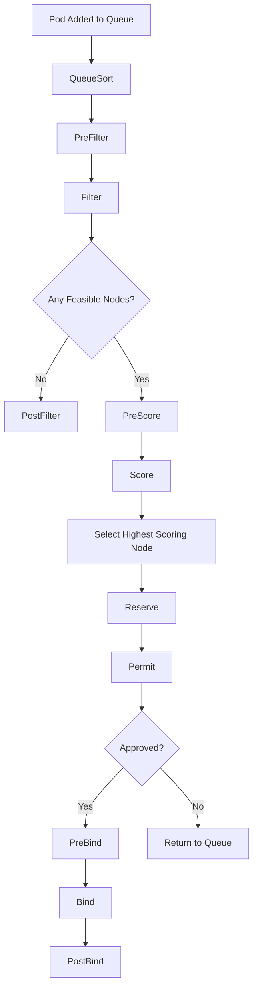

# Scheduler Plugins

The Kubernetes scheduler framework allows you to customize how pods are assigned to nodes. The scheduler evaluates pods against nodes using a series of plugins organized into two phases: Filter (removes nodes that cannot run the pod) and Score (ranks remaining nodes).

## Scheduler Framework Overview

The scheduler framework uses a plugin architecture. Plugins are registered at compile time or via a scheduling profile in `kube-scheduler-configuration`. Each plugin can participate in one or more scheduling phases.

### Scheduling Phases

1. **QueueSort**: Orders pending pods (only one plugin active at a time).
2. **PreFilter**: Pre-processes pod information and checks cluster-wide conditions.
3. **Filter**: Eliminates nodes that cannot run the pod.
4. **PostFilter**: Runs if no feasible nodes remain after filtering.
5. **PreScore**: Pre-processes information for scoring plugins.
6. **Score**: Ranks feasible nodes with a score between 0 and 100.
7. **Reserve**: Reserves resources on the selected node before binding.
8. **Permit**: Allows or rejects the pod (can delay binding).
9. **PreBind**: Pre-bind tasks (e.g., network configuration).
10. **Bind**: Binds the pod to the node.
11. **PostBind**: Post-bind tasks (e.g., metrics, logging).



## Built-in Scheduler Plugins

### NodeName

Checks if the pod has a `nodeName` field set. If set, the plugin passes the pod to that node directly without scoring.

**Configuration:** No configuration required.

### NodeAffinity

Filters and scores nodes based on `nodeAffinity` rules in the pod spec. Supports `requiredDuringSchedulingIgnoredDuringExecution` and `preferredDuringSchedulingIgnoredDuringExecution`.

**Example:**

```yaml
affinity:
  nodeAffinity:
    requiredDuringSchedulingIgnoredDuringExecution:
      nodeSelectorTerms:
        - matchExpressions:
            - key: kubernetes.io/arch
              operator: In
              values:
                - amd64
    preferredDuringSchedulingIgnoredDuringExecution:
      - weight: 50
        preference:
          matchExpressions:
            - key: topology.kubernetes.io/zone
              operator: In
              values:
                - us-west-1a
```

### NodeUnschedulable

Filters out nodes marked as unschedulable (`spec.unschedulable: true`). These nodes are tainted or cordoned and should not receive new pods.

### NodePorts

Filters out nodes that do not have all required host ports available. If a pod requests a `hostPort`, this plugin checks whether any other pod already occupies that port on the node.

### PodTopologySpread

Enforces `topologySpreadConstraints` across nodes, zones, or other topology domains. Prevents pods from being concentrated in a single topology domain.

**Example:**

```yaml
topologySpreadConstraints:
  - maxSkew: 1
    topologyKey: topology.kubernetes.io/zone
    whenUnsatisfiable: DoNotSchedule
    labelSelector:
      matchLabels:
        app: my-app
```

### InterPodAffinity

Filters and scores nodes based on `podAffinity` and `podAntiAffinity` rules. Places pods close to (or far from) other pods matching specific labels.

### NodeResourcesFit

Filters out nodes that do not have sufficient CPU or memory to run the pod. Checks against `requests` and `limits` depending on the mode.

**Modes:**
- **`Reserved`** (default): Checks resource availability accounting for reservations and overhead.
- **`LessCPU`**: Prefers nodes where the requested CPU is less than allocatable (not recommended for production).

### NodeResourcesBalancedAllocation

Scores nodes based on resource balance. Prefers nodes with balanced CPU and memory utilization. Avoids nodes where one resource is heavily used while another is idle.

### NodeLeastRequested

Scores nodes based on the amount of requested resources (CPU and memory). Prefers nodes with fewer requested resources, distributing load evenly.

### NodeMostRequested

Scores nodes based on the amount of requested resources. Prefers nodes with more requested resources, packing workloads densely.

### ServiceAffinity

Filters and scores nodes based on service selector labels. Spreads pods of the same service across different nodes for high availability.

### VolumeRestrictions

Filters out nodes where the pod would access a volume already mounted by another pod at a path that does not support multi-attach.

### VolumeBinding

Filters out nodes that do not have sufficient available PVs that satisfy the pod's PVC requirements. Supports dynamic provisioning.

### EBSVolumeLimits

Filters out nodes that would exceed EBS volume attachment limits. Relevant for AWS environments.

### NodeShutdown

Prevents pods from being scheduled on nodes that are shutting down. Respects the `node.kubernetes.io/out-of-service` taint.

### NodeTaintTolerations

Filters out nodes whose taints are not tolerated by the pod. This is the primary mechanism for pod-to-node affinity based on taints.

## Scheduling Profiles

You can configure custom scheduling profiles in a KubeSchedulerConfiguration file. Each profile can enable, disable, or configure specific plugins.

**Example: kube-scheduler-config.yaml**

```yaml
apiVersion: kubescheduler.config.k8s.io/v1
kind: KubeSchedulerConfiguration
profiles:
  - schedulerName: my-scheduler
    plugins:
      filter:
        enabled:
          - name: NodeResourcesFit
          - name: NodePorts
          - name: NodeAffinity
      score:
        enabled:
          - name: NodeResourcesBalancedAllocation
            weight: 5
          - name: NodeLeastRequested
            weight: 3
        disabled:
          - name: NodeMostRequested
```

## Third-Party Scheduler Plugins

### Descheduler

The Descheduler evicts pods from nodes based on policies, allowing the scheduler to reschedule them. It runs as a separate deployment and helps balance cluster resources over time.

**Policies:**
- **RemovePodsHavingTooManyRestarts**: Evicts pods with excessive restarts.
- **LowNodeUtilization**: Evicts pods from underutilized nodes.
- **HighNodeUtilization**: Evicts pods to free overcommitted nodes.
- **RemoveFailedPods**: Evicts failed pods after a timeout.
- **RemovePodsViolatingInterPodAntiAffinity**: Enforces anti-affinity rules.

### KubeSchedulerPolicy

You can define a `Pod Scheduling Policy` (PodLevel) to override the default scheduler for specific pods.

## Plugin Comparison

| Plugin | Phase | Type | Purpose |
|--------|-------|------|---------|
| NodeName | Filter | Built-in | Direct node assignment via nodeName |
| NodeAffinity | Filter/Score | Built-in | Node label-based filtering and scoring |
| PodTopologySpread | Filter/Score | Built-in | Spread pods across topology domains |
| NodeResourcesFit | Filter | Built-in | Check resource availability |
| NodeResourcesBalancedAllocation | Score | Built-in | Balance CPU/memory utilization |
| NodeLeastRequested | Score | Built-in | Prefer nodes with fewer requested resources |
| NodeMostRequested | Score | Built-in | Prefer nodes with more requested resources |
| NodeTaintTolerations | Filter | Built-in | Taint-based node filtering |
| VolumeBinding | Filter | Built-in | Check PV availability |
| ServiceAffinity | Filter/Score | Built-in | Service-aware node placement |
| Descheduler | N/A | Third-party | Evict and reschedule existing pods |

## Best Practices

1. **Use topology spread constraints**: Prefer `PodTopologySpread` over pod anti-affinity for better distribution across zones and nodes.
2. **Balance score weights**: Use balanced weights (e.g., 5 for resource balance, 3 for least requested) to avoid over-optimizing for a single metric.
3. **Monitor scheduler decisions**: Enable scheduler profiling to understand why pods land on specific nodes.
4. **Use `WaitForFirstConsumer`**: For volume scheduling, use StorageClasses with `WaitForFirstConsumer` binding mode to ensure volumes are created in the correct zone.
5. **Avoid hard pod anti-affinity**: Use topology spread constraints instead, as anti-affinity requires the scheduler to know about all existing pods.

## Troubleshooting

| Symptom | Likely Cause | Fix |
|---------|-------------|-----|
| Pod stuck in `Pending` | No feasible node after filtering | Check scheduler events: `kubectl describe pod <pod>` |
| Pods concentrated in one node | Topology spread not configured or ignored | Add `topologySpreadConstraints` to pod spec |
| Pod rejected by node | Taint not tolerated or resource insufficient | Check `kubectl describe node <node>` for taints and resource requests |
| Scheduler profiling shows low scores | Score plugin weights misconfigured | Review scheduler configuration profile |
| Pod evicted unexpectedly | Descheduler policy active | Review Descheduler configuration or add tolerations |

## Commands

```bash
# Check which scheduler a pod uses
kubectl get pod <pod-name> -o jsonpath='{.spec.schedulerName}'

# Check scheduler configuration
kubectl get configmap -n kube-system kube-scheduler-config -o yaml
kubectl get kube-scheduler -n kube-system -o yaml

# View scheduler logs
kubectl logs -n kube-system -l component=kube-scheduler -c kube-scheduler

# Check scheduler profiling endpoint
curl -sk https://<scheduler-endpoint>/debug/pprof/profile?seconds=30

# View pod scheduling decisions
kubectl get events --field-selector reason=Scheduled

# Check node resource requests
kubectl describe node <node-name> | grep -A 10 'Allocated resources'

# List scheduler profiles
kubectl get --raw /apis/scheduling.k8s.io/v1/schedulerprofiles

# Run a test pod with custom scheduler
kubectl run test --image=alpine --restart=Never --overrides='{"apiVersion":"v1","spec":{"schedulerName":"my-scheduler"}}' -- sleep 3600

# Check taints and tolerations
kubectl describe node <node> | grep -A 5 'Taints'
kubectl get pod <pod> -o jsonpath='{.spec.tolerations}'
```
