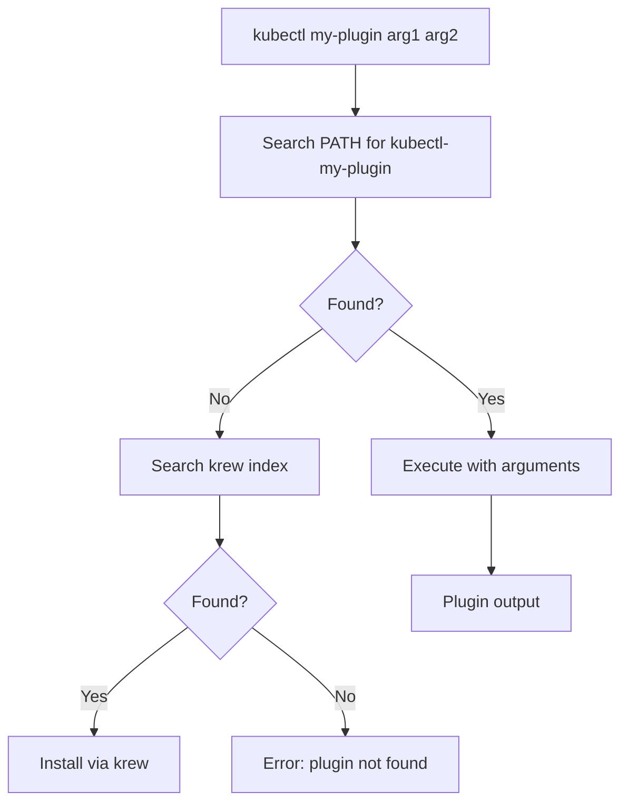

# kubectl CLI Plugins

kubectl plugins extend the functionality of the Kubernetes CLI. They follow the `kubectl-<subcommand>` naming convention and are discovered automatically when placed on the `PATH`. Plugins can be standalone binaries, scripts, or installed via package managers like `krew`.

## Plugin Discovery

kubectl discovers plugins by scanning the `PATH` for executables named `kubectl-*`. When you run `kubectl plugin-name`, kubectl searches for `kubectl-plugin-name` on the `PATH`.

```bash
# List available plugins
kubectl plugin list
```

## Plugin Categories

### Plugin Management

#### krew

krew is the plugin manager for kubectl CLI plugins. It provides a central repository of plugins with installation, upgrade, and removal commands.

**Installation:**

```bash
# Linux (amd64)
set -x; cd "$(mktemp -d)" && \
OS="$(uname | tr '[:upper:]' '[:lower:]')" && \
ARCH="$(uname -m | sed -e 's/x86_64/amd64/' -e 's/arm64/arm64/' -e 's/aarch64/arm64/')" && \
KREW="krew-${OS}_${ARCH}" && \
curl -fsSLO "https://github.com/kubernetes-sigs/krew/releases/latest/download/${KREW}.tar.gz" && \
tar zxvf "${KREW}.tar.gz" && \
./"${KREW}" install krew
```

**Usage:**

```bash
# Update plugin index
kubectl krew update

# Search for plugins
kubectl krew search

# Install a plugin
kubectl krew install ns
kubectl krew install ctx
kubectl krew install stern
kubectl krew install view-secret

# Upgrade all plugins
kubectl krew upgrade

# Uninstall a plugin
kubectl krew uninstall ns
```

### Context and Namespace Switching

#### kubectx / kubens

kubectx and kubens allow fast switching between kubectl contexts and namespaces.

**Installation:**

```bash
# Using krew
kubectl krew install ctx
kubectl krew install ns

# Or install directly
git clone https://github.com/ahmetb/kubectx /opt/kubectx
ln -s /opt/kubectx/kubectx /usr/local/bin/kubectx
ln -s /opt/kubectx/kubens /usr/local/bin/kubens
```

**Usage:**

```bash
# Switch context
kubectx production
kubectx staging

# List contexts
kubectx

# Switch namespace
kubens default
kubens my-app-ns

# List namespaces
kubens
```

### Logging and Monitoring

#### stern

stern streams logs from multiple pods and containers simultaneously. It supports tailing, filtering by regex, and following logs across rolling updates.

**Installation:**

```bash
kubectl krew install stern
```

**Usage:**

```bash
# Stream logs from all pods matching a label
kubectl stern -l app=my-app

# Stream logs with color
kubectl stern -c my-container my-pod

# Tail last 100 lines
kubectl stern --tail 100 -l app=my-app

# Exclude containers
kubectl stern -l app=my-app --exclude-container 'sidecar'
```

#### kubetail

kubetail tails logs from multiple pods (similar to stern).

```bash
kubectl krew install tail
```

### Debugging and Inspection

#### view-secret

Decodes Kubernetes Secrets without extracting them manually.

**Installation:**

```bash
kubectl krew install view-secret
```

**Usage:**

```bash
# View a secret
kubectl view-secret my-secret

# View specific key
kubectl view-secret my-secret -k username
```

#### who-can

Shows which RBAC subjects have permission to perform a specific action.

**Installation:**

```bash
kubectl krew install who-can
```

**Usage:**

```bash
# Who can create pods?
kubectl who-can create pods
kubectl who-can get pods --all-namespaces
```

#### kubectl-whoami

Displays the identity of the current user and impersonation details.

**Usage:**

```bash
# Current user info
kubectl whoami

# With RBAC review
kubectl whoami --list
```

#### node-shell

Opens a root shell on a node using `kubectl debug`.

**Usage:**

```bash
kubectl node-shell <node-name>
```

### Resource Navigation

#### change-ns

Quickly change the active namespace.

```bash
kubectl krew install change-ns
```

#### neat

Removes clutter from `kubectl get` output, making YAML cleaner.

```bash
kubectl krew install neat
kubectl get pod my-pod -o yaml | kubectl neat
```

### Security

#### kubectl-tree

Displays the RBAC hierarchy for a resource.

```bash
kubectl krew install tree
kubectl tree roles --role-ref
```

### Workload Management

#### krew plugins for Helm

While Helm is a separate tool, some plugins integrate Helm with kubectl.

## Popular Plugins Table

| Plugin | Purpose | Installation |
|--------|---------|--------------|
| `krew` | Plugin manager | Direct install |
| `ctx` | Switch kubectl contexts | `kubectl krew install ctx` |
| `ns` | Switch namespaces | `kubectl krew install ns` |
| `stern` | Multi-pod log streaming | `kubectl krew install stern` |
| `view-secret` | Decode secrets | `kubectl krew install view-secret` |
| `who-can` | RBAC permission viewer | `kubectl krew install who-can` |
| `tree` | RBAC hierarchy viewer | `kubectl krew install tree` |
| `neat` | Clean YAML output | `kubectl krew install neat` |
| `tail` | Tail logs (older alternative to stern) | `kubectl krew install tail` |

## Writing a Custom kubectl Plugin

A kubectl plugin is any executable on the `PATH` named `kubectl-plugin-subcommand`.

### Bash Plugin Example

```bash
#!/bin/bash
# File: kubectl-hello-world
# Make executable: chmod +x kubectl-hello-world

set -euo pipefail

echo "Hello from kubectl plugin!"
echo "Arguments: $*"
```

### Go Plugin Example

```go
package main

import (
    "fmt"
    "os"
)

func main() {
    fmt.Println("Hello from kubectl plugin!")
    fmt.Printf("Arguments: %v\n", os.Args[1:])
}
```

```bash
# Build and install
go build -o kubectl-hello-world
chmod +x kubectl-hello-world
mv kubectl-hello-world /usr/local/bin/
```

### Advanced Plugin Example (krew format)

krew plugins are distributed as archives with a specific structure.

```yaml
# plugins/krew-index/plugins/my-plugin.yaml
apiVersion: krew.sh/v1alpha2
kind: Plugin
metadata:
  name: my-plugin
spec:
  version: "v0.1.0"
  platforms:
    - bin: "kubectl-my-plugin"
      files:
        - from: ./kubectl-my-plugin
          to: ./kubectl-my-plugin
      selector:
        matchLabels:
          os: linux
          arch: amd64
  homepage: https://github.com/user/my-plugin
  shortDescription: "My custom kubectl plugin"
  description: |
    A longer description of what my plugin does.
  caveats: |
    Any caveats or limitations go here.
```

## Plugin Architecture



## Best Practices

1. **Use krew for plugin management**: Provides versioning, upgrades, and discovery.
2. **Keep plugins on PATH**: Ensure `/usr/local/bin` or your preferred bin directory is on `PATH`.
3. **Pin plugin versions**: Use `krew install plugin@version` for reproducible environments.
4. **Verify plugin signatures**: Before installing unknown plugins, review the source code.
5. **Use plugins that enhance existing workflows**: Avoid plugins that replace core kubectl commands unnecessarily.

## Troubleshooting

| Symptom | Likely Cause | Fix |
|---------|-------------|-----|
| `plugin not found` | Plugin binary not on PATH or krew index outdated | Verify `echo $PATH`, run `kubectl krew update` |
| `permission denied` | Plugin binary not executable | `chmod +x /path/to/kubectl-plugin` |
| Plugin executes but fails | Missing dependencies or incorrect configuration | Check plugin documentation, verify prerequisites |
| `krew install` hangs | Network issue or krew server unreachable | Check network, verify `KREW_OS` and `KREW_ARCH` |
| `plugin list` shows no plugins | PATH does not include plugin directory | Add plugin directory to `PATH` |
| Plugin conflicts with built-in command | Plugin name matches existing kubectl subcommand | Rename plugin or use fully qualified invocation |

## Commands

```bash
# List available plugins (krew)
kubectl krew list

# Search plugins
kubectl krew search

# Install plugin
kubectl krew install <plugin-name>

# Upgrade plugin
kubectl krew upgrade <plugin-name>

# Uninstall plugin
kubectl krew uninstall <plugin-name>

# Verify plugin installation
kubectl plugin list
which kubectl-<plugin-name>

# View plugin info
kubectl <plugin-name> --help

# Check krew installation
kubectl krew version

# Update krew index
kubectl krew update

# Check PATH for plugins
echo $PATH | tr ':' '\n' | xargs -I{} ls -1 {}/kubectl-* 2>/dev/null
```
